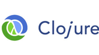

# DiveIntoClojure

#  

Clojure is a dialect of Lisp, and is predominantly a functional programming language.

Here we cover with examples the most important features of the language.

Is this repo useful? Please ⭑Star this repository and share the love.

 
## Features

**[Variables](src/com/politrons/Variables.clj)**

**[Types](src/com/politrons/Types.clj)**

**[Functions](src/com/politrons/Functions.clj)**

**[Pipelines](src/com/politrons/Pipelines.clj)**

**[Async](src/com/politrons/Async.clj)**
